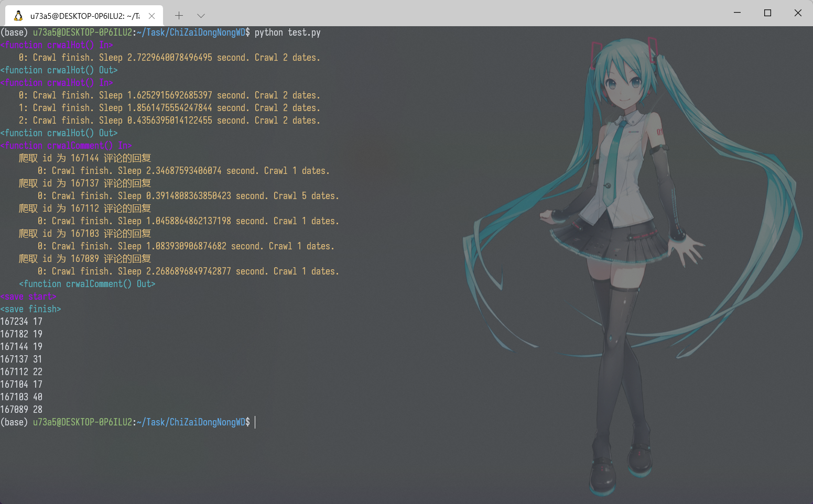

# ChiZaiDongNongWD
用于爬取[东农饭团](http://czneau.com/)上的数据。

## 样例
```python
import czneau

dld = czneau.CCN()

dld.indentSize = 4
dld.pageSize = 2

dld.crawlHot() # 获取热评
dld.crawlHot(2) # 继续获取热评
dld.crawlComment()
dld.saveData('czneau.json')

for key in dld: # 遍历所有内容打印键和值
    print(key, a[key]['likeCount'])

# print(a.values()) # 拥有所有 dict的方法
```


## 部分数据说明
<details>
<summary>获取评论保持原json数据不变。</summary>

```python
CCN() = {
    int() # 键值，即为 value中的 id
    :{
        'id': int(), # 使用 id 判定是否为相同数据
        'content': str(), # 评论内容
        'likeCount': int(), # 点赞数
        'commentCount': int(), # 评论数
        'commentList': list(), # 仅在 commentCount 非 0 时有该关键字，非原 json数据
        ##...
    },
    ##...
}
```
</details>
<details>
<summary>获取的回复添加在原json数据中。</summary>

```python
# commentCount非 0 时有
CCN()[0]['commentList'] = [
    {
        'id': int(), # 该 id 不参与任何判断
        'content': str(), # 回复内容
        'likeCount': int(), # 回复点赞数
        ##...
    },
    ##...
]
```
</details>

## 额外接口说明
<details>
<summary>数据相关</summary>

```python
## 爬取热评
def crawlHot(self,
    crawlTimes=1, # 爬取次数；(2022/4/3)默认'pageSize'='29'下，当其值约为3500时可以爬取所有数据(该值为估算，没有测试)。
    sleepTime=None, # 每次爬取间隔,默认在[0, 1]秒之间
    level=0 # 为优化后续封装的输出做的工作
) -> int: ...

## 爬取最新评论
def crawlNew(self,
    crawlTimes=1,
    sleepTime=None, # 每次爬取间隔,默认在[0, 1]秒之间
    level=0
) -> int: ...

## 爬取评论回复 // 默认爬取时不爬取评论
def crawlComment(self,
    sleepTime=None, # 每次爬取间隔,默认在[0, 3]秒之间
    level=0
) -> None: ...
## 加载已有数据
def loadData(self,
    file: str # 数据存放地址
) -> bool: ...

## 保存数据
def saveData(self,
    file: str # 数据存放地址
) -> bool:
```
</details>


<details>
<summary>爬取参数设置</summary>

```python
CCN().proxies = { # 代理设置
    'http': 'http://0.0.0.0:0000',
    'https': 'https://0.0.0.0:0000'
}
CCN().pageSize = 17 # 每次请求数据大小，默认在[15, 29]内随机选取，不能超过 29
CCN().indentSize = 4 # 用于控制输出缩进，默认为 2
CCN().userAgent = [] # 接受一个字符串或列表，请求用户代理从这里随机选取。默认有 51条
```
</details>

<details>
<summary>异常捕获</summary>

```python
CCN().raiseEE = True # 是否抛出按预期捕获的异常，默认抛出
CCN().errorMax = 3 # 当 CCN().raiseEE=False 时，异常捕获超过约定次数后抛出 RaiseCountError ，默认次数为 3 次
```
</details>


## 安装
```bash
pip install czneau
```
