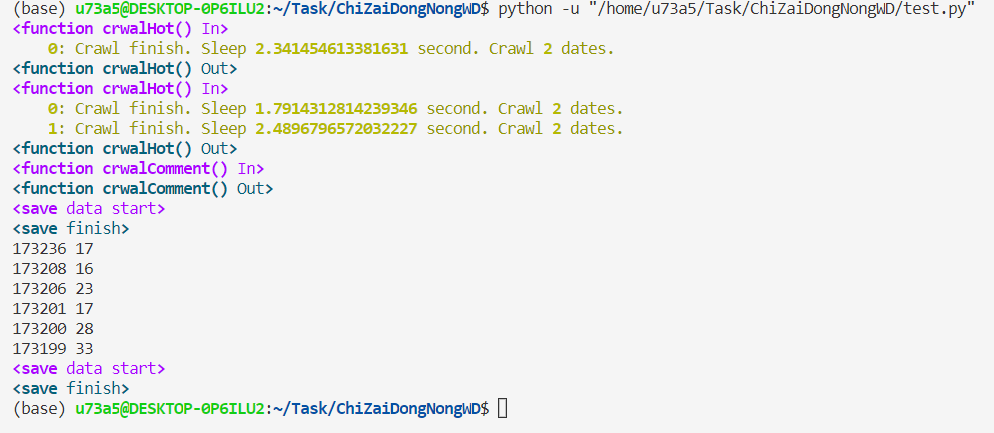
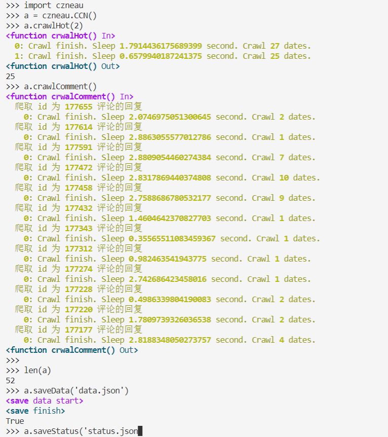
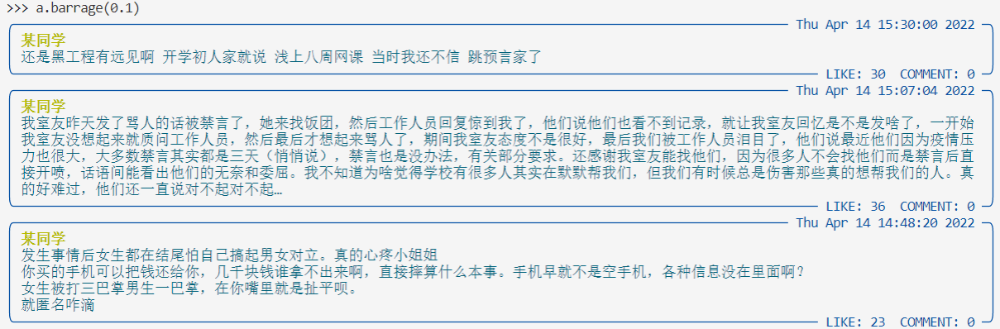
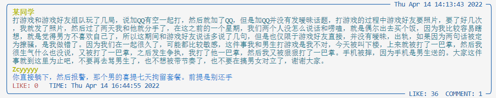
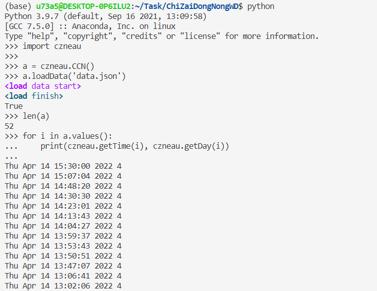

# ChiZaiDongNongWD

用于爬取[东农饭团](http://czneau.com/)上的数据。

## 样例

<details>
<summary>一个简单样例</summary>

```python
import czneau

dld = czneau.CCN()

dld.indentSize = 4
dld.pageSize = 2

dld.crawlHot() # 获取热评
dld.crawlHot(2) # 继续获取热评
dld.crawlComment()
dld.saveData('czneau.json')

for key in dld: # 遍历所有内容打印键和值
    print(key, dld[key]['likeCount'])

dld.saveStatus('downloadStatus.json') # 保存下载状态，以在其它地方加载以继续下载

# print(a.values()) # 拥有所有 dict的方法
```


</details>
<details>
<summary>一个更安全的样例</summary>

```python
import czneau

a = czneau.CCN()

a.raiseEE = False
try:
    a.crawlHot(50)
except czneau.RaiseCountError:
    print(f'The Expect Error has raised {a.errorMax} times.')
## WARNING:
# 这里可以被忽视的异常只有 ProxyError 和 ChunkedEncodingError
# 达到异常次数上限后抛出 RaiseCountError
# 如需更保险的方式，请尝试
#     try: a.crawlHot(50)
#     except:
#         # 处理异常 #

a.saveData('a_data.json')
a.saveStatus('a_status.json')
```

</details>

## 部分数据说明

<details>
<summary>获取评论保持原json数据不变。</summary>

```python
CCN() = {
    int() # 键值，即为 value中的 id
    :{
        'id': int(), # 使用 id 判定是否为相同数据
        'nickname': str(), #
        'content': str(), # 评论内容
        'likeCount': int(), # 点赞数
        'commentCount': int(), # 评论数
        'commentList': list(), # 仅在 commentCount 非 0 时有该关键字，非原 json数据
        'date': int() # 与发表时间相关
        ##...
    },
    ##...
}
```

</details>
<details>
<summary>获取的回复添加在原json数据中。</summary>

```python
# commentCount非 0 时有
CCN()[0]['commentList'] = [
    {
        'id': int(), # 该 id 不参与任何判断
        'nickname': str(),
        'content': str(), # 回复内容
        'likeCount': int(), # 回复点赞数
        'date': int() # 与发表时间相关
        ##...
    },
    ##...
]
```

</details>

## 额外接口说明

<details>
<summary>数据相关</summary>

```python
## 爬取热评
def crawlHot(self,
    crawlTimes=1, # 爬取次数；(2022/4/3)默认'pageSize'='29'下，当其值约为3500时可以爬取所有数据(该值为估算，没有测试)。
    sleepTime=None, # 每次爬取间隔,默认在[0, 1]秒之间
    level=0 # 为优化后续封装的输出做的工作
) -> int: ...

## 爬取最新评论
def crawlNew(self,
    crawlTimes=1,
    sleepTime=None, # 每次爬取间隔,默认在[0, 1]秒之间
    level=0
) -> int: ...

## 爬取评论回复 // 默认爬取时不爬取评论
def crawlComment(self,
    sleepTime=None, # 每次爬取间隔,默认在[0, 3]秒之间
    level=0
) -> None: ...
## 加载已有数据
def loadData(self,
    file: str # 数据存放地址
) -> bool: ...

## 保存数据
def saveData(self,
    file: str # 数据存放地址
) -> bool:
```

### 如需要评论或回复的日期，在[没什么用函数](./Readme.md#no_use_function)中查找


</details>


<details>
<summary>爬取参数设置</summary>

```python
CCN().proxies = { # 代理设置
    'http': 'http://0.0.0.0:0000',
    'https': 'https://0.0.0.0:0000'
}
CCN().pageSize = 17 # 每次请求数据大小，默认在[15, 29]内随机选取，不能超过 29
CCN().indentSize = 4 # 用于控制输出缩进，默认为 2
CCN().userAgent = [] # 接受一个字符串或列表，请求用户代理从这里随机选取。默认有 51条

## 加载下载状态
# 加载下载状态而不加载数据或加载非上次任务数据，均将从加载的状态出发继续下载
CCN().loadStatus(self,
    file: str # 状态存放地址
) -> bool: ...

## 保存下载状态
CCN().saveStatus(self,
    file: str # 状态存放地址
) -> bool: ...
```

</details>

<details>
<summary>异常捕获</summary>

```python
CCN().raiseEE = True # 是否抛出按预期捕获的异常，默认抛出
CCN().errorMax = 3 # 当 CCN().raiseEE=False 时，异常捕获超过约定次数后抛出 RaiseCountError ，默认次数为 3 次
```

</details>
<details>
<summary>一些没什么用函数</summary>
<a href='#no_use_function'></a>

```python
## 弹幕输出内容，就是玩
def barrage(self,
    sleepTime: int=3 # 默认每个对话输出后停留 3秒
    comment: bool=True # 输出是否包含回复，默认包含
) -> None: ...

## baseData 为 CCN() 实例中的每一个元素
def getTime(x: baseData) -> str: ... # 获取评论或回复时间 'Thu Apr 14 16:41:12 2022'
def getDay(x: baseData) -> int: ... # 获取信息发表当天是星期几 1~7
def getMonth(x: baseData) -> int: ... # 获取信息发表当天是几月 1~12
def getDate(x: baseData) -> int: ... # 获取信息发表当天是记号 1~28/29/30/31
def getHour(x: baseData) -> int: ... # 获取信息发表时是几时 0~24
def getMinute(x: baseData) -> int: ... # 获取信息发表时是几分  0~60
def getSecond(x: baseData) -> int: ... # 获取信息发表时是几秒 0~60
def getYear(x: baseData) -> int: ... # 获取信息发表在那一年 2022
```




</details>


## 安装

```bash
pip install czneau
```
